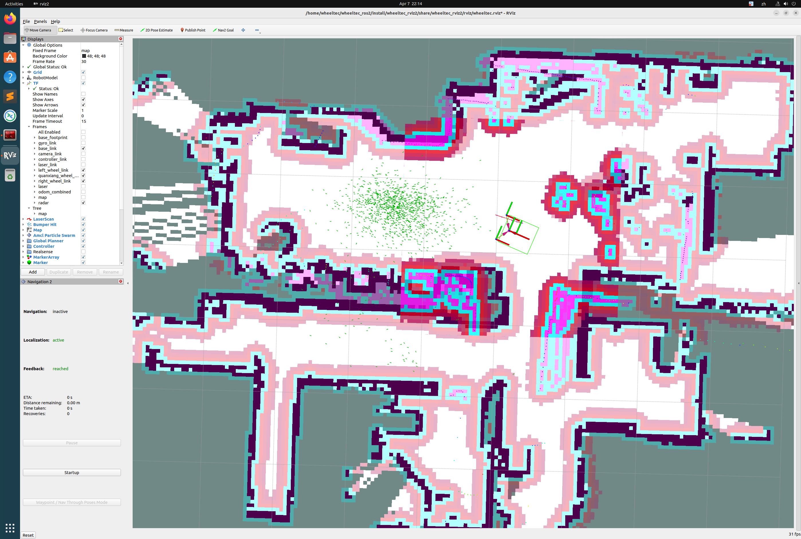

# Nav2 202602 版本迁移

## 目标

将 nav2 参数和 robot 配置更新到 202602 版本，改善定位精度。本次调试机器基于senior_diff。

## 当前状态：进行中

## 已完成

- 更新 `param_senior_diff.yaml` 和 `wheeltec_param.yaml` 到 202602 版本
- 定位精度有明显改善

## 已知问题

- 地图存在累计误差（随着导航次数的变多，雷达的点云与map的墙壁产生偏移 可以参考图片）, 这个现象是不可接受的。

## 待办

